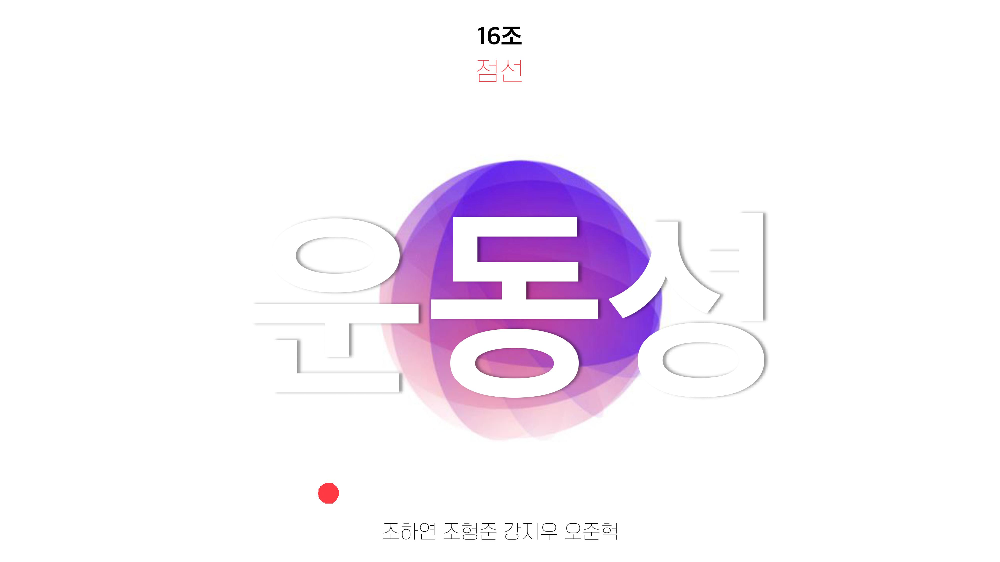
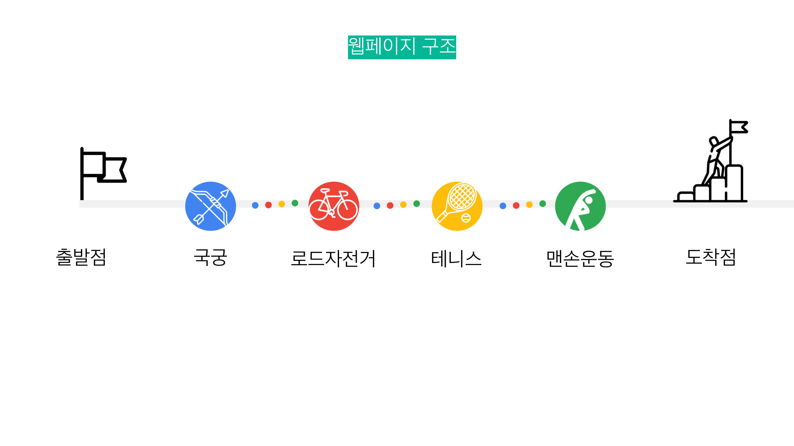

# 2021-interactivemedia-active

데모영상 : https://drive.google.com/file/d/15z8PFvlJQbGLHNbEtU-Dj06-SUBx68WH/view?usp=sharing

[인터랙티브미디어개론수업]_인터랙트웹페이지_'운동성'

  

  

  

  

* 협업 환경  
안드로이드 모바일 
깃허브 VSCODE live share 

* 주제  
4명 각자가 하는 운동을 소개하며 점들이 하나의 선으로 이어지는 과정을 통해 
서로 다른 4명이 운동이라는 공통점 중, 좋은점을 모아 운동성있는 코스 웹페이지를 만들고 
코로나 19 상황에서 실재로 관심과 참여의 마음을 유도하는 <b>'운동성'<b>을 주제로 웹페이지를 소개한다. 

* 순서
[페이지별 BGM - 각 운동마다 실제로 이 운동을 하고 있는 담당자가 내래이션 설명으로 서사를 뷰어에게 설명하는 인터랙티브]

1. dot : 점과 점 사이 hover 시 선 연결 인터랙티브 생성 - 점이 선으로 이어지는 상황을 시각화
2. bow : 마우스 클릭(터치)으로 강도를 조절해 과녁에 화살을 맞추는 게임 인터랙티브 - <b>국궁<b> 소개
3. bike : 키보드 방향 키로 자전거를 운전하는 게임 인터랙티브 - <b>로드자전거<b> 소개
4. tennis : 마우스 hover로 라켓을 움직여 공을 주고 받는 게임 인터랙티브 - <b>테니스<b> 소개
5. qr : 다음 웹페이지로 넘어가는 QR코드 - 핸드폰으로 상호작용을 하도록 유도
6. punch : 핸드폰을 기울여 - 손목을 이용한 맨손 운동 참여를 유도
7. firework : 마우스 클릭(터치) 시 불꽃이 생성되는 인터랙티브 - 점을 찍으면 불꽃이 터지는 효과로 가만히 있는 움직임이 다채로운 운동성을 지니고 있음을 인터랙티브 묘사
